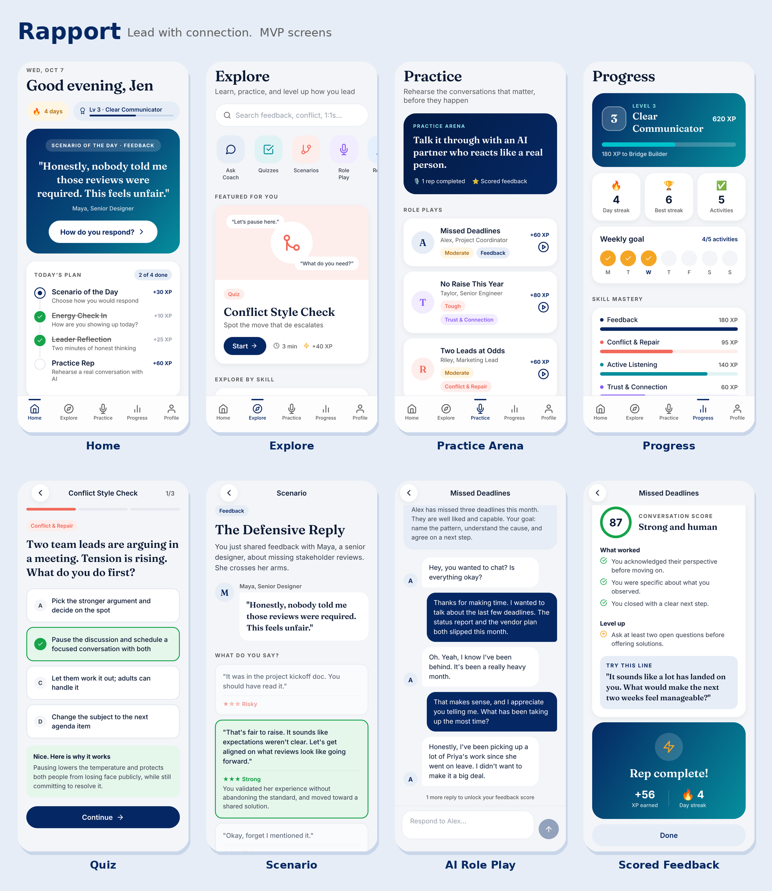

# Rapport

**Lead with connection.** A gamified mobile app that helps people leaders and HR professionals get better at feedback, conflict resolution, listening, and building trust with the people they lead and work with.



## What is in the MVP

| Feature | Where |
| --- | --- |
| Daily plan with streaks and XP (scenario, energy check in, reflection, practice rep) | Home |
| Scenario of the Day: choose your response, get rated feedback | `src/app/scenario/[id].tsx` |
| Quizzes with instant explanations | `src/app/quiz/[id].tsx` |
| AI role plays: rehearse with a simulated employee, then get a scored debrief | `src/app/roleplay/[id].tsx` |
| Ask Coach Ari: an AI coach for any leadership question | `src/app/coach.tsx` |
| Private leader reflections | `src/app/reflect.tsx` |
| Onboarding: name, role, team size, focus areas, reminder time | `src/app/onboarding.tsx` |
| Accounts with cloud backup of progress (Supabase) | `src/app/sign-in.tsx`, `src/state/Account.tsx` |
| Weekday reminder notifications | `src/services/reminders.ts` |
| Change management and culture: quizzes, scenarios, and AI role plays in Leading Change and Culture Shifts | `src/data/content.ts` |
| Change Message Builder: draft a change announcement, then polish it with Ari | `src/app/change-message.tsx` |
| Effective Meetings, 1:1s That Matter, Digital Communication, and Presence & Presenting skill areas | `src/data/content.ts` |
| Tone Check: see how an email or chat message will land before sending it | `src/app/tone-check.tsx` |
| Skill areas with mastery bars | Explore and `src/app/area/[id].tsx` |
| Levels, badges, weekly goal, team leaderboard | Progress |
| English, Spanish, and French (picker on the welcome screen and in Profile). Coach Ari replies in the chosen language | `src/i18n/`, `src/data/i18n/` |

Gamification lives in `src/state/AppState.tsx` (XP, levels, streaks, badges, weekly goal). Content lives in `src/data/content.ts` so new quizzes, scenarios, and role plays can be added without touching screens.

Translations: interface text is written in English in the code and wrapped in `t()`; `src/i18n/es.ts` and `src/i18n/fr.ts` map it to Spanish and French. The content library's translations live in `src/data/i18n/`, keyed by the same ids as `content.ts`, so answers and scores always come from the English source. Anything missing falls back to English.

## Run it

```bash
npm install
npx expo start        # press i for iOS simulator, a for Android, w for web
```

Scan the QR code with the Expo Go app to try it on your phone. On Windows, follow the step by step guide in [docs/RUN_ON_WINDOWS.md](docs/RUN_ON_WINDOWS.md). To put it on a phone without connecting to your computer, see [docs/PREVIEW_ON_PHONE.md](docs/PREVIEW_ON_PHONE.md).

### Turning on the AI coach and accounts

Out of the box the app runs fully on the device and the coach runs in **demo mode** with scripted replies, so everything is clickable without any keys. One Supabase project turns on both the live Claude coach and account sign in. Follow [docs/SETUP_AI_AND_ACCOUNTS.md](docs/SETUP_AI_AND_ACCOUNTS.md); it takes about 20 minutes and needs no coding.

The Anthropic API key stays on the server. The app never sees it.

## Scripts

| Command | What it does |
| --- | --- |
| `npm run typecheck` | TypeScript check |
| `npx expo lint` | Lint |
| `npm run export:web` | Builds the web version into `dist/` |
| `npm run screenshots` | Renders `dist/` in Chromium and saves phone screenshots to `docs/screenshots/` |

See [docs/ROADMAP.md](docs/ROADMAP.md) for the plan from MVP to the App Store.
